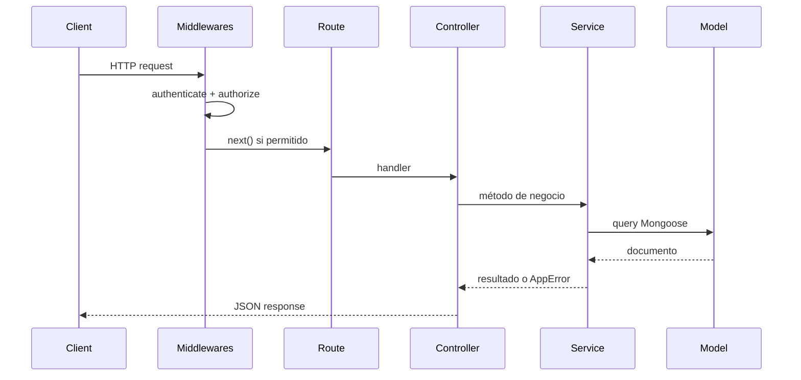

# Arquitectura — Backend

## Estructura del repo

Este directorio **es** el repo backend (`opticapp-back`):

```
opticapp-back/               ← raíz del repo (este workspace)
├── SPECS.md
├── specs/
├── .cursor/rules/
├── package.json
├── pnpm-lock.yaml
├── .prettierrc
├── eslint.config.js
├── .env.example
├── uploads/                   # No commitear binarios; sí .gitkeep
│   ├── anteojos/
│   └── lentes/                # Reservada (futuro)
└── src/
    ├── index.ts
    ├── configs/
    │   ├── app.ts
    │   ├── db.ts
    │   ├── multer.ts          # Config multer (destino, límites)
    │   └── permissions.json
    ├── middlewares/
    │   ├── authenticate.ts
    │   ├── authorize.ts
    │   ├── upload.ts          # Middleware multer por ruta/contexto
    │   └── errorHandler.ts
    ├── routes/
    ├── controllers/
    ├── services/
    ├── models/
    ├── validations/
    ├── helpers/
    ├── utils/
    │   └── mapDocument.ts     # _id → id centralizado
    ├── errors/
    ├── types/
    └── scripts/
        └── initApp.ts         # Crea admin único en DB
```

> **Nota:** `configs/` también alojará `socket.io.ts` cuando una spec futura lo requiera. Hasta entonces, no crear archivos de Socket.io.

El frontend vive en un **repo hermano** (`opticapp-front`). Ver su `specs/architecture.md` para rutas y carpetas de UI.

---

## Convención de rutas HTTP

**Las rutas NO llevan prefijo `/api`.** Se declaran directamente como `/{recurso}`.

| Correcto | Incorrecto |
|----------|------------|
| `GET /products` | `GET /api/products` |
| `POST /auth/login` | `POST /api/auth/login` |
| `GET /health` | `GET /api/health` |

El frontend usa `VITE_API_URL` apuntando a la raíz de este servidor (ej. `http://localhost:3000`).

---

## Contrato de API

### Respuestas exitosas

`res.json(data)` — el payload va **directo**, sin wrapper `{ data: ... }`.

Ejemplos:

```typescript
// GET /products/:id
res.json({ id: '...', brand: 'Ray-Ban', ... });

// GET /health
res.json({ status: 'ok', mongodb: 'connected' });
```

### Listado paginado (excepción estructurada)

`GET /products?page=1&limit=12` devuelve:

```json
{
  "items": [ /* ProductPublic[] */ ],
  "total": 48,
  "page": 1,
  "limit": 12,
  "totalPages": 4
}
```

Defaults: `page=1`, `limit=12`.

### Errores

Siempre `{ "message": "..." }` en **español**. Código y variables del proyecto en **inglés**.

### Serialización MongoDB → JSON

- Exponer `id` (string), **nunca** `_id` al cliente.
- Usar `utils/mapDocument.ts` en services (ver [conventions.md](conventions.md)).

---

## Health check

`GET /health` (etapa 1):

```json
{
  "status": "ok",
  "mongodb": "connected"
}
```

Si MongoDB no conecta al consultar: `"mongodb": "disconnected"` y `status: "degraded"` (o 503 según implementación).

---

## Upload de imágenes (Multer)

| Aspecto | Decisión |
|---------|----------|
| Librería | Multer |
| Almacenamiento | Disco: `uploads/{categoria}/` |
| Categorías | `anteojos/` (MVP), `lentes/` (reservada) |
| Nombre archivo | `{productId}_{datetime}.{ext}` |
| En MongoDB | Solo **URL** pública de la imagen, no binario |
| Servir archivos | `express.static` en `/uploads` |
| Middleware | `middlewares/upload.ts` + config en `configs/multer.ts` |

URL ejemplo: `http://localhost:3000/uploads/anteojos/674abc_20260820143000.jpg`

Etapa 2: infraestructura multer + static + seed con imágenes de ejemplo.  
Etapa 4: upload desde formulario admin al crear/editar producto.

---

## Permisos por role (`permissions.json`)

Archivo: `src/configs/permissions.json`

Define qué **methods + route** puede ejecutar cada role. Rutas **no listadas** en ningún role son **públicas** (sin auth).

### Formato (agrupado por route)

```json
{
  "admin": [
    { "route": "/admin/products", "methods": ["GET"] },
    { "route": "/products",       "methods": ["POST"] },
    { "route": "/products/:id",  "methods": ["PUT", "DELETE"] },
    { "route": "/auth/me",       "methods": ["GET"] },
    { "route": "/auth/logout",   "methods": ["POST"] }
  ]
}
```

Reglas:

- Clave = `role` del JWT (`admin`, etc.).
- Valor = array de `{ route, methods[] }`. Varios HTTP verbs sobre la misma ruta se agrupan en un solo objeto.
- `route` usa params Express (`:id`). El middleware debe matchear `/products/abc123` contra `/products/:id`.
- El middleware `authorize` verifica que `req.method` esté incluido en `methods` del entry que matchee `req.path`.
- Un consumidor **sin token** o con token inválido que intente un endpoint listado → `401`.
- Un usuario autenticado cuyo role **no tiene** ese method+route → `403`.
- Rutas públicas (ej. `GET /products`, `POST /auth/login`, `GET /health`) **no se declaran** en el JSON.

---

## Middlewares globales en `configs/app.ts`

**No repetir middlewares en cada archivo de routes.** Se registran una sola vez:

```typescript
app.use(express.json());
app.use(cors({ origin: CLIENT_URL, credentials: true }));
app.use(cookieParser());

app.use(authenticate);   // Si la ruta es protegida y no hay token válido → 401
app.use(authorize);      // Lee permissions.json; valida role + method + route → 403

app.use(routes);
app.use(errorHandler);   // Siempre al final
```

| Middleware | Qué hace |
|------------|----------|
| `authenticate` | Si la request apunta a ruta protegida (presente en `permissions.json`), exige JWT válido y no vencido en cookie. Adjunta `req.user`. Si la ruta es pública, pasa sin token. |
| `authorize` | Cruza `req.method` + `req.path` con las entradas del role en `permissions.json`. Si no coincide → `403`. |

Los archivos en `routes/` **solo declaran path + controller**. Sin `authenticate` ni `authorize` inline.

## Convención de archivos por capa

Un recurso = un archivo `{resource}.ts` por carpeta. **Sin** sufijos `.routes`, `.controller`, `.service`.

| Capa | Ejemplo |
|------|---------|
| `routes/product.ts` | Router Express |
| `controllers/product.ts` | `export const productController = { ... }` |
| `services/product.ts` | `export const productService = { ... }` |

Detalle completo en [conventions.md](conventions.md).

---

## Flujo de una request



## Capas y responsabilidades

| Capa | Responsabilidad | No debe |
|------|-----------------|---------|
| `routes` | Definir path, método HTTP, handler | Contener lógica ni middlewares de auth |
| `controllers` | Parsear req, invocar service, formatear res | Acceder a Mongoose directo |
| `services` | Lógica de negocio, orquestar models | Conocer req/res de Express |
| `models` | Schema + índices Mongoose | Validar HTTP |
| `middlewares` | Auth, authorize, error handler | Lógica de negocio |
| `validations` | Schemas de input (Zod) | Acceder a DB |
| `configs/permissions.json` | Declarar permisos por role | Contener lógica ejecutable |

---

## Autenticación (etapa 3+)

1. `POST /auth/login` con email + password (ruta pública).
2. Backend valida credenciales, genera JWT con `exp`.
3. JWT en cookie `httpOnly`, `sameSite: 'lax'`, `secure: false` en dev, `secure: true` en production.
4. Middlewares globales protegen rutas listadas en `permissions.json`.
5. Admin único creado con `scripts/initApp.ts` (lee credenciales desde env).

Variables de entorno:

```
JWT_SECRET=
JWT_EXPIRES_IN=1d
COOKIE_NAME=token
ADMIN_EMAIL=
ADMIN_PASSWORD=
ADMIN_FIRST_NAME=
ADMIN_LAST_NAME=
```

---

## Manejo de errores

Clase `AppError`:

```typescript
class AppError extends Error {
  statusCode: number;  // 400 | 401 | 403 | 404 | 409 | 500
  isOperational: boolean;
}
```

| statusCode | Cuándo |
|------------|--------|
| 400 | Validación fallida, input inválido |
| 401 | Token ausente, inválido o expirado en ruta protegida |
| 403 | Token válido pero role sin permiso para method+route |
| 404 | Recurso no encontrado |
| 409 | Conflicto (ej. email duplicado, brand+model+color duplicado) |
| 500 | Error inesperado del servidor |

---

## Endpoints

| Endpoint | Acceso | Etapa |
|----------|--------|-------|
| `GET /health` | Público | 1 |
| `GET /products` | Público, paginado, solo publicados, sin soft-deleted | 2 |
| `GET /products/:id` | Público (solo publicados) | 2 |
| `POST /auth/login` | Público | 3 |
| `POST /auth/logout` | Admin (`permissions.json`) | 3 |
| `GET /auth/me` | Admin (`permissions.json`) | 3 |
| `GET /admin/products` | Admin | 4 |
| `POST /products` | Admin | 4 |
| `PUT /products/:id` | Admin | 4 |
| `DELETE /products/:id` | Admin | 4 |

> `GET /products` es público; `POST /products` requiere admin. El middleware distingue por **method + route**.

---

## CORS y cookies

- Frontend Axios: `withCredentials: true`.
- CORS: origin del frontend (`CLIENT_URL`) + `credentials: true`.
- Desarrollo: frontend `http://localhost:5173`, backend `http://localhost:3000`.

---

## Variables de entorno (`.env.example`)

```
PORT=3000
MONGODB_URI=mongodb://localhost:27017/opticapp
JWT_SECRET=change-me
JWT_EXPIRES_IN=1d
COOKIE_NAME=token
NODE_ENV=development
CLIENT_URL=http://localhost:5173
UPLOADS_BASE_URL=http://localhost:3000/uploads
ADMIN_EMAIL=admin@opticapp.com
ADMIN_PASSWORD=change-me
ADMIN_FIRST_NAME=
ADMIN_LAST_NAME=
```
